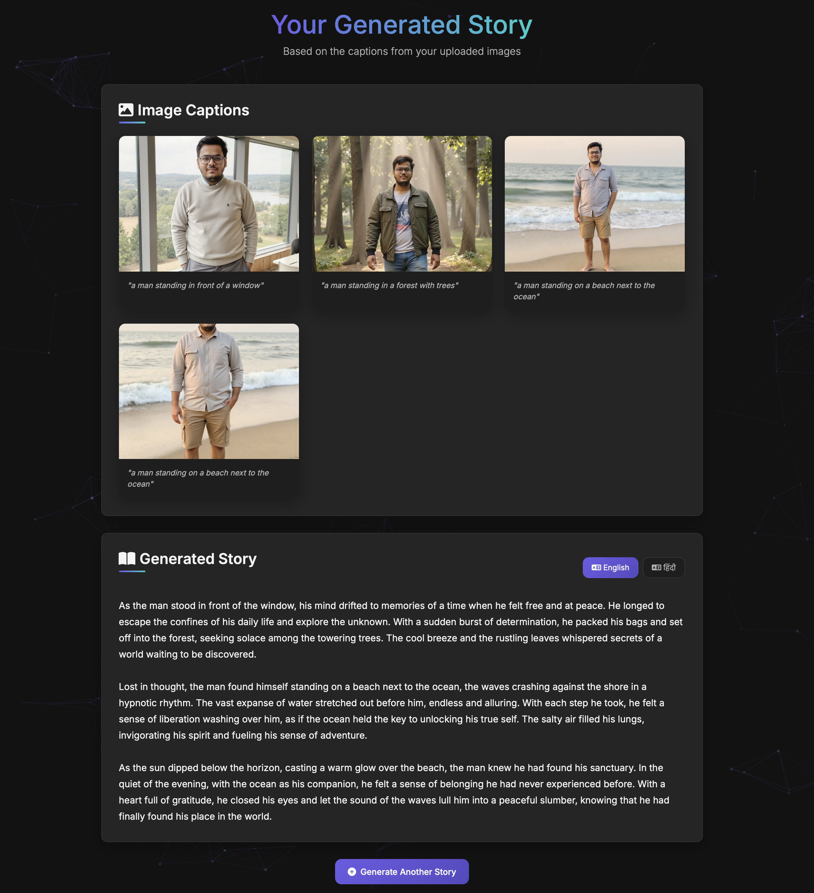

# Image Caption Story Generator


A modern web application that generates creative stories from multiple images using AI image captioning and natural language processing. The application features a dark-themed UI with animations, dynamic views, and English to Hindi translation capabilities.

## 📸 Screenshot



## 🎬 Demo

Check out the video demo of the application in action:

[Download Video Demo](assets/sample.mp4)

## 🌟 Features

- **Multi-Image Upload**: Upload 2-5 images to generate a cohesive story
- **AI Image Captioning**: Automatically generates captions for each uploaded image
- **Story Generation**: Creates a coherent story connecting all the image captions
- **English to Hindi Translation**: Translate generated stories to Hindi with a single click
- **Modern Dark UI**: Sleek dark-themed interface with animations and visual effects
- **Responsive Design**: Works on desktop and mobile devices
- **Real-time Processing**: Visual feedback during image processing and story generation

## 🛠️ Technologies Used

- **Backend**: Flask (Python)
- **Frontend**: HTML, CSS, JavaScript
- **AI Models**:
  - Image Captioning: Hugging Face's VisionEncoderDecoderModel (ViT-GPT2)
  - Story Generation: OpenAI's GPT models via LangChain
  - Translation: Helsinki-NLP's Marian MT model for English to Hindi translation
- **Animation**: Custom CSS animations and transitions
- **Particle Effects**: particles.js for background effects

## 📋 Prerequisites

- Python 3.8 or higher
- pip (Python package manager)
- OpenAI API key (for story generation)

## 🚀 Installation

1. **Clone the repository**:
   ```bash
   git clone [<repository-url>](https://github.com/Akshat-Gupta04/Image-Caption-Story-Generator.git)
   cd image_caption_story
   ```

2. **Create and activate a virtual environment** (optional but recommended):
   ```bash
   python -m venv venv

   # On Windows
   venv\Scripts\activate

   # On macOS/Linux
   source venv/bin/activate
   ```

3. **Install the required packages**:
   ```bash
   pip install -r requirements.txt
   ```

4. **Set up environment variables**:
   Create a `.env` file in the project root directory with the following content:
   ```
   OPENAI_API_KEY=your_openai_api_key_here
   ```

## 🏃‍♂️ Running the Application

1. **Start the Flask server**:
   ```bash
   python app.py
   ```

2. **Access the application**:
   Open your web browser and navigate to:
   ```
   http://127.0.0.1:5000
   ```

## 📱 How to Use

1. **Upload Images**:
   - Click on the upload area or drag and drop 2-5 images
   - Supported formats: JPG, JPEG, PNG, GIF

2. **Generate Story**:
   - Click the "Generate Story" button
   - Wait for the processing to complete (you'll see a progress indicator)

3. **View Results**:
   - See the captions generated for each image
   - Read the story created based on these captions

4. **Translate to Hindi**:
   - Click the "हिंदी" button to translate the story to Hindi
   - Switch back to English by clicking the "English" button

5. **Generate Another Story**:
   - Click "Generate Another Story" to start over with new images

> **Note**: Check out the video demo in the `assets/sample.mp4` file to see the application in action. A screenshot of the application is also available in `assets/image.png`.

## 🖼️ Application Structure

```
image_caption_story/
├── app.py                  # Main Flask application
├── static/                 # Static files
│   ├── css/                # CSS stylesheets
│   │   └── style.css       # Main stylesheet
│   ├── js/                 # JavaScript files
│   │   └── main.js         # Main JavaScript file
│   ├── favicon/            # Favicon files
│   │   └── favicon.svg     # SVG favicon
│   └── uploads/            # Uploaded images (created at runtime)
├── templates/              # HTML templates
│   ├── index.html          # Home page template
│   ├── processing.html     # Processing page template
│   └── results.html        # Results page template
├── assets/                 # Demo assets
│   ├── sample.mp4          # Video demo of the application
│   └── image.png           # Screenshot of the application
├── .env                    # Environment variables
├── requirements.txt        # Python dependencies
└── README.md               # This file
```

## 🧠 AI Models

### Image Captioning Model
The application uses the `nlpconnect/vit-gpt2-image-captioning` model from Hugging Face, which combines a Vision Transformer (ViT) for image encoding and GPT-2 for caption generation.

### Story Generation
Stories are generated using OpenAI's language models through LangChain, creating coherent narratives that connect the image captions.

### Translation Model
For English to Hindi translation, the application uses the `Helsinki-NLP/opus-mt-en-hi` model from Hugging Face's Transformers library.

## ✨ UI Features

- **Dark Theme**: Modern dark-themed UI for reduced eye strain
- **Particle Background**: Interactive particle animation in the background
- **Loading Animations**: Visual feedback during processing
- **Image Hover Effects**: Dynamic effects when hovering over images
- **Typewriter Effect**: Text appears with a typewriter animation
- **Translation Animation**: Visual effects during the translation process
- **Responsive Design**: Adapts to different screen sizes

## 📝 Notes

- The first run may take longer as the models are downloaded and loaded
- Processing time depends on the number and size of the uploaded images
- For optimal performance, use images with clear subjects and good lighting
- The application requires an internet connection for the OpenAI API calls

## 🔒 Privacy

- Uploaded images are stored temporarily on the server
- No user data is collected or shared with third parties
- Images and generated content are not used for training AI models

## 🤝 Contributing

Contributions are welcome! Please feel free to submit a Pull Request.

## 📄 License

This project is licensed under the MIT License - see the LICENSE file for details.

## 🙏 Acknowledgements

- [Hugging Face](https://huggingface.co/) for the image captioning and translation models
- [OpenAI](https://openai.com/) for the language models
- [LangChain](https://langchain.com/) for the language model integration
- [Flask](https://flask.palletsprojects.com/) for the web framework
- [particles.js](https://vincentgarreau.com/particles.js/) for the particle background
